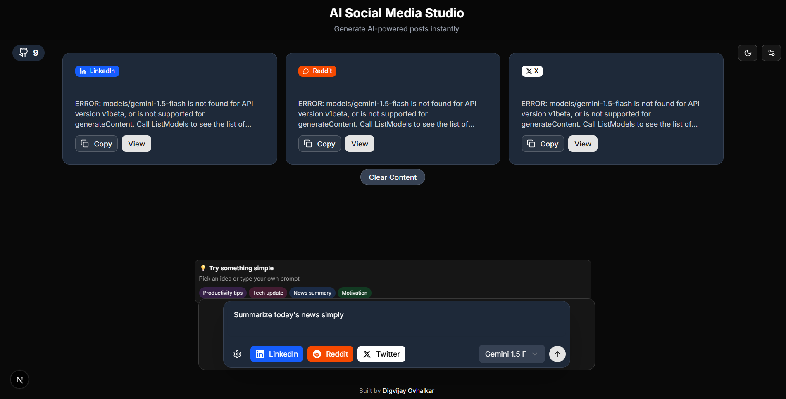

🌟 Open AI Social Media Content Studio

 alt="Open AI Social Media Content Studio Hero Image" />

AI-powered content generator for LinkedIn, Reddit, and X (Twitter)

🌐 Live Demo

👨‍💻 About the Project

Open AI Social Media Content Studio is a smart AI tool that helps you instantly generate high-quality social media posts for platforms like:

🔵 LinkedIn
🐦 X (Twitter)
🔴 Reddit

It uses powerful AI models like OpenAI GPT and Google Gemini to create engaging, platform-optimized content.

✨ Features
🎯 Multi-platform content generation (LinkedIn, X, Reddit)
⚙️ Smart post customization (tone, style, format)
🤖 Supports OpenAI GPT & Google Gemini APIs
🔐 Secure API key encryption (stored in localStorage)
🎨 Modern UI with dark/light mode support
📱 Fully responsive design (mobile + desktop friendly)
🔐 API Key Security

This project includes secure client-side encryption for API keys.

Setup

Create a .env.local file in the root directory:

NEXT_PUBLIC_ENCRYPTION_KEY=your-secure-32-character-key
How it works
API keys are encrypted before saving in the browser
Only encrypted data is stored in localStorage
Keys are decrypted only when needed for AI generation
🚀 Getting Started
1. Clone the repository
git clone https://github.com/Digvijay-Ovhalkar/AI_Social_Media_Content_Studio_-Like-a-mini-Canva-ChatGPT-.git
cd AI_Social_Media_Content_Studio_-Like-a-mini-Canva-ChatGPT-
2. Install dependencies
npm install
3. Add environment variables

Create .env.local file:

NEXT_PUBLIC_ENCRYPTION_KEY=your-secure-32-character-key
4. Run the project
npm run dev
5. Open in browser
http://localhost:3000
📖 How to Use
Add your OpenAI / Gemini API key
Enter your content prompt (e.g. "Write a LinkedIn post about AI")
Choose platform (LinkedIn / X / Reddit)
Select tone & style
Click Generate
Copy and post 🚀
🛠️ Tech Stack
⚛️ Next.js 15
🟦 TypeScript
🎨 Tailwind CSS
🧩 shadcn/ui
🤖 OpenAI API / Gemini API
🔐 Crypto-based encryption
🚀 Vercel Deployment
👨‍💻 Author

Digvijay Ovhalkar

GitHub: Digvijay-Ovhalkar
🤝 Contributing
1. Fork the repo
2. Create a new branch
3. Make changes
4. Commit changes
5. Push and create PR
📄 License

This project is licensed under the MIT License.

⭐ Support

If you like this project:

⭐ Star the repo
🐛 Report issues
🚀 Share with others

Made with ❤️ by Digvijay Ovhalkar

